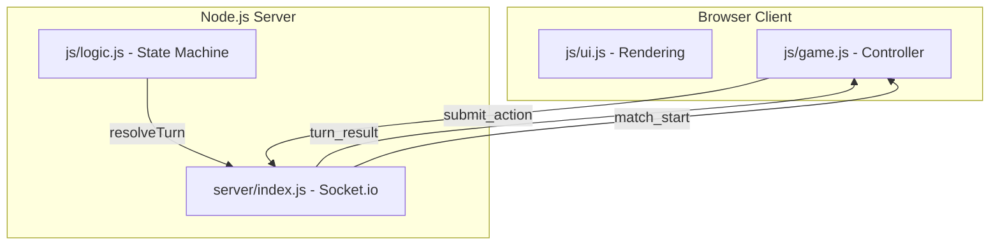

# Shared Intent Arena - Project Documentation

## 1. Project Overview
**Shared Intent Arena** (internal name: `intelGame`) is a deterministic, strategy-focused browser game. It features a unique simultaneous-turn resolution system where two players commit their actions in secret, and then the results are calculated and played out concurrently.

The game is designed with a high skill ceiling, focusing on prediction, resource management, and strategic positioning on a 16x16 symmetrical grid.

---

## 2. Core Game Rules

### 📖 Full Gameplay Rules
For a complete breakdown of movement, combat, energy penalties, and bot difficulties, please refer to:
👉 **[MECHANICS.md](./MECHANICS.md)**

---


### Strategic Mechanics
- **Repeated Action Penalty**: Using the same action type consecutively increases the cost by **+1 Energy**.
- **Forced Variation Bonus**: Using different action types provides a **+1 Energy Regen** bonus.
- **Resource Overuse Penalty**: Harvesting the same tile type too frequently (2+ times in recent history) triggers a **Fatigue Penalty** (+1 Energy cost next turn).
- **Collision Rules**:
  - **Bounce**: Players moving to the same tile bounce back to their starting positions.
  - **Head-on**: Players swapping tiles bounce back.
  - **Stationary Block**: Moving into a stationary opponent results in zero movement.

---

## 3. Architecture

The project follows a **Client-Server** model with an **Authoritative Server**.



### Shared Logic (`js/logic.js`)
A Universal Module (UMD) that contains the "Ground Truth" of the game rules. This ensures that both the server (Node.js) and the client (Browser) use identical calculations for energy costs, movement, and collisions.

### Server (`server/index.js`)
- **Framework**: Node.js + Express + Socket.io.
- **Responsibility**:
  - Matchmaking (auto-pairing players into rooms).
  - Action Queuing (hiding intents until both commit).
  - Authoritative Turn Resolution.
  - Timer Management (60-second turn timeouts).
  - Win Condition Checking (broadcasting `game_over`).

### Client (`js/game.js` & `js/ui.js`)
- **game.js**: Handles socket communication and high-level game flow.
- **ui.js**: Pure rendering logic using standard DOM manipulation. It interprets the game state received from the server and updates the visual grid and stats.

---

## 4. Current Implementation Status

### ✅ Completed Features
- **Multiplayer Foundation**: Socket-based matchmaking and real-time communication.
- **Authoritative Resolution**: Server calculates all state changes; clients are "dumb" terminals.
- **Symmetrical Map Generation**: Balanced resource placement.
- **Special Tiles & Cooldowns**: Functional harvesting and deactivation system.
- **Strategic Penalties**: Repeated action and resource overuse logic implemented.
- **Shield & Attack Mechanics**: Fully functional resolution order.

### ⚠️ Known Issues / In Progress
- **Match Start Synchronization**: Intermittent issue where the second client fails to receive the `match_start` event.
- **Server-Side Action Validation**: Server currently performs some validation but needs more robust energy/cost verification to prevent hacked clients from sending invalid actions.
- **Missing UI Polish**: Needs "Opponent Thinking" indicators and a turn timer display.
- **Win Condition Refinement**: Automated game cleanup after a win needs more testing.

### 🧪 Testing
- **Simulation Match**: `tests/sim_match.js` provides a headless multi-client simulation to verify core resolution logic across the network.

---

## 5. Directory Structure
```text
/
├── server/
│   └── index.js          # Node.js server (Socket.io)
├── js/
│   ├── logic.js          # Shared UMD rule engine
│   ├── game.js           # Client-side networked controller
│   └── ui.js             # Visual renderer
├── css/
│   └── style.css         # Game styling
├── tests/
│   └── sim_match.js      # Automated socket simulation
├── index.html            # Main entry point
├── package.json          # Dependency & script definition
└── README.md             # Quick-start guide
```

---

## 🚀 How to Run
1.  **Install**: `npm install`
2.  **Start Server**: `npm start` (runs `node server/index.js`)
3.  **Play**: Open `http://localhost:3000` in two separate browser tabs.
